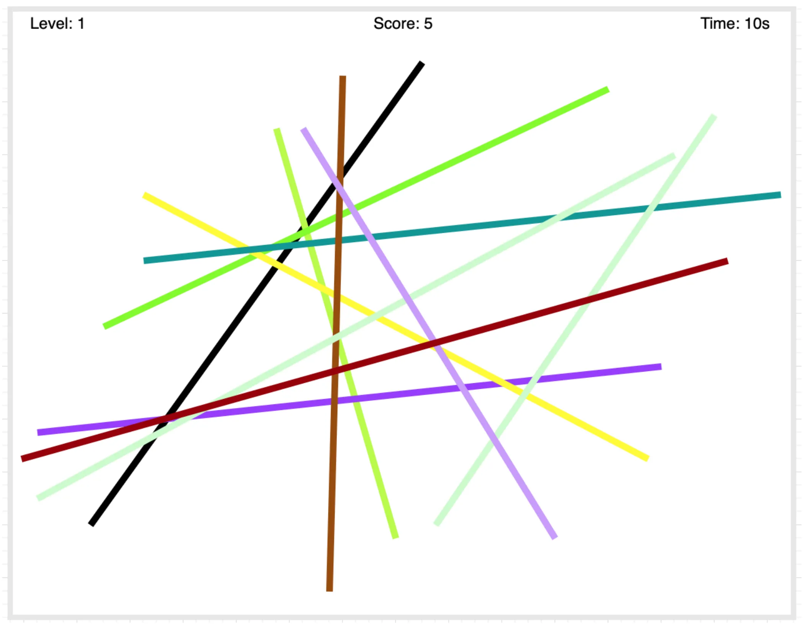
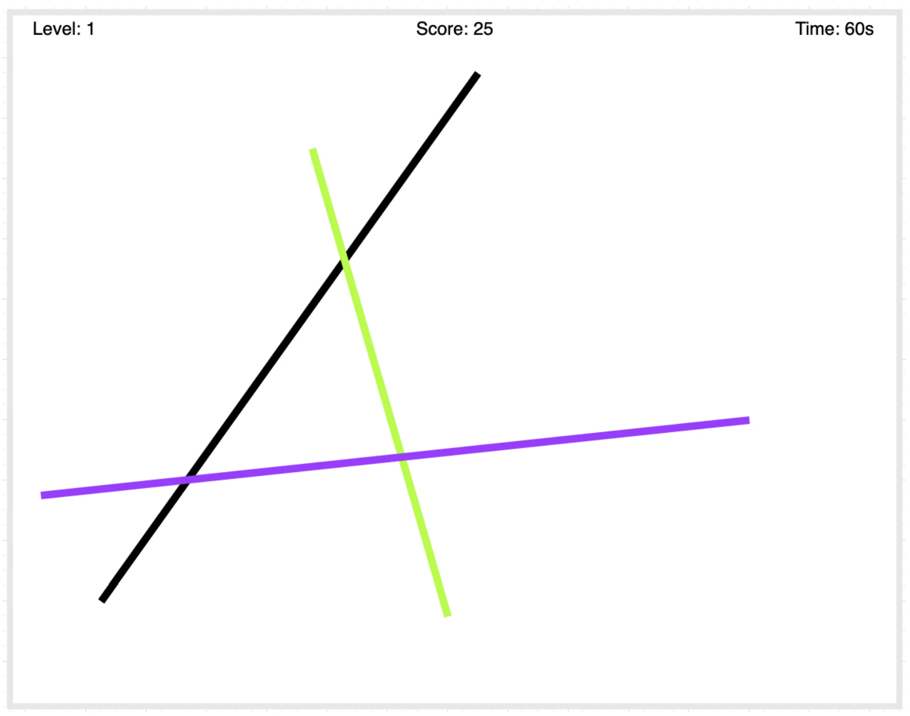

Problem Statement
Create a board game where a number of straws are randomly placed on the board. The player must click on the topmost straw. When correctly clicked, the straw disappears and the player earns a point. The player continues clicking the next topmost straw until all straws are removed. If the player clicks on a straw that is not on top, they should be notified that it's not the correct choice.

Requirements
Must-Have Features:
Randomly generate straws on the screen, each with a different color
Allow removal of the topmost straw when clicked
Continue until the board is empty
Allow clicking any straw if straws are not overlapping
Ensure all straws appear inside the screen boundaries
Make straw length configurable (with a minimum length if not specified)
Implement user experience enhancements:
Change cursor to pointer on hover
Animation to indicate incorrect straw selection
Bonus Features (if time permits):
Collect player name before starting the game
Implement a countdown timer for each level
Increase complexity with each level
Display a scoreboard showing:
Player name
Levels completed
Top score
Total time played
Player	Levels completed	Top score	Total time played
Player 1	4	4500	01:45:12
Player 2	3	4321	01:00:23
Player 3.	2	2000	05:50:13
Mockups

Technical Constraints:
Try to written solution in vanilla JavaScript and CSS
You can use external libraries or frameworks (jQuery, React, Angular, Bootstrap, etc.) but it is not preferred.
The solution must work without errors
Apply a minimalist visual design and layout
Evaluation Criteria:
Correctness and completeness of the solution
Code design and quality
Visual aesthetics
Technology choices (preference for modern JavaScript)
Understanding of the problem statement
Submission
Start the timer, complete your solution, test your solution against the test cases provided by the platform, and submit it. Ideally, you should finish this question within 60-90 mins.

Share your solution with us on twitter or linkedin